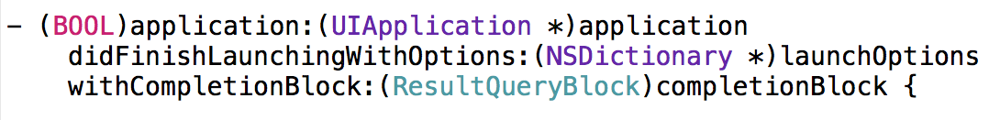
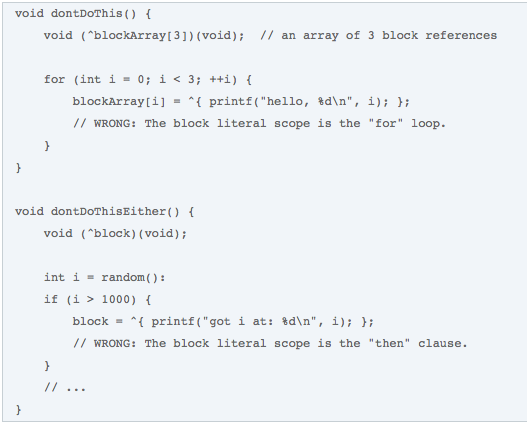

**Code Style**

1. **Nomenclaturas de arquivos**

    1. **Class**

O padrão [UpperCamelCase](https://en.wikipedia.org/wiki/CamelCase) é recomendado para nomear arquivos de classes e utilizar o prefixo de 2 ou 3 letras que facilite identificar classes do projeto, exemplo:

* HenrySchein

    * **HSN**LoginViewController

    * **HSN**HTTPClient

* TetraPak

    * **TPK**LoginViewController

    * **TPK**OperationManager

E para as classes que herdam de um componente do UIKit framework, o nome deve terminar com o nome do componente, exemplo: CITLogin**ViewController**, CITDashboard**View**, CITClients**TableViewController**, CITCards**CollectionViewController**, etc.

2. **Resources**

    1. **Convenções para Icones:**

Convenções para Button state:

<table>
  <tr>
    <td>Sufixo</td>
    <td>Exemplo</td>
  </tr>
  <tr>
    <td>_normal</td>
    <td>button_normal</td>
  </tr>
  <tr>
    <td>_pressed</td>
    <td>button_pressed</td>
  </tr>
  <tr>
    <td>_disabled</td>
    <td>button_disabled</td>
  </tr>
  <tr>
    <td>_selected</td>
    <td>button_selected</td>
  </tr>
</table>

2. **Objective-C Style**

    3. **Properties**

As propriedades devem ser cadastradas no inicio da classe, com as seguintes regras:

* Componente, sempre utilizar o tipo do componente como sufixo, e.g: login**Button**, username**TextField**, information**Label**

* Sempre iniciar com letra minúscula.

* O nome declarado será o mesmo utilizado pelo getter/setter. Se a propriedade for escrita como um verbo ou substantivo o formato é:

* Se o nome for declarado como um adjetivo, então o nome da propriedade oculta o prefixo *"is", *você deve especificá-lo no get acessor.

* Certifique-se de que o nome de uma variável de instancia descreve exatamente o atributo alocado. Não se deve acessar a variável de instancia diretamente, para isso utilize os *"acessor methods"*. Só acessamos uma variável de instancia diretamente nos métodos init e dealloc, para isso faça.

4. **Métodos**

A assinatura do método deve ser algo auto explicativa quando lida. Por exemplo o método:

Se tiramos os parâmetros a assinatura lida seria: **touchesBeganWithEvent**

O método sempre deve cuidar de pequenas funções, ter um objetivo, caso ultrapasse de 40 linhas pense na possibilidade de separar em outro método sem prejudicar a estrutura.

* Em geral não abrevie nomes. Escreva mesmo que seja longo.

* Use palavras-chave antes de todos os argumentos.

* Faça com que a palavra que antecede o argumento o descreva.

	

    5. **Ordens dos itens da classe**

Não existe uma forma correta de ordenar os itens de uma classe, mas uma ordem lógica e consistente facilita a leitura e entendimento do código. Nós recomendamos a seguinte ordem:

1. Imports

2. Constantes

3. Protocolos

4. Atríbutos

5. Construtores

6. Métodos publicos

7. Métodos Privados

8. Override de métodos e callbacks

    6. **Ordenação dos parâmetros de métodos e callbacks**

As interfaces de *callback* devem ser o último parâmetro.

**2.5.	Enumerated Constants**

* Use *enumerations *para grupos de constantes relacionadas que possuem valores inteiros

**2.6.	Delegate Methods**

* Inicie o nome identificando a classe de objeto que está enviando a mensagem.

* Use "did" ou "will" para métodos invocados para notificar o delegate de que algo aconteceu ou acontecerá.

* Embora você possa usar *"did"* ou *"will"* para métodos que são invocados para perguntar ao delegate para fazer algo a favor de outro objeto, é melhor utilizar *"should"*

**2.6. Blocks**

* **Declarando e utilizando um Block**

* **Usando um Block diretamente**

* **Padrões que devem ser evitados**

[**ObjClean**](http://objclean.com/index.php)**:**

* [FullVersion](https://checkout.paddle.com/pay/2005746-chrea8fe174f405-b68729dbe7)

* [Free Trial](http://bit.ly/1nI4auv)

* [Template File](https://drive.google.com/a/ciandt.com/file/d/0B-zev7olcxWtZFNkMXUtbFVobDQ/view?usp=sharing)

**Source:**[https://developer.apple.com/library/mac/documentation/Cocoa/Conceptual/CodingGuidelines/CodingGuidelines.html#//apple_ref/doc/uid/10000146-SW1](https://developer.apple.com/library/ios/documentation/Cocoa/Conceptual/CodingGuidelines/CodingGuidelines.html#//apple_ref/doc/uid/10000146-SW1)
