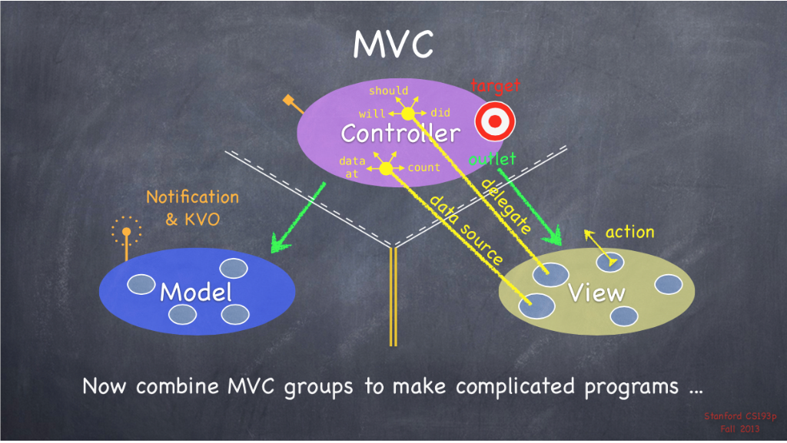

# Modelo de Camadas

Esse documento apresenta um modelo de arquitetura baseado em MVC, porém customizado para atender o desenvolvimento mobile em Objective-C.

No iOS, tanto em Objective-C quanto em Swift, as divisões em camada é apenas lógica, sendo separadas em grupos no XCode, podendo também ser separada fisicamente no repositório do seu projeto, sendo isso uma boa prática. No entanto é necessário disciplina por parte dos desenvolvedores, pois como o XCode não gera automaticamente um novo folder para cada grupo criado, precisamos criá-las sempre que um novo grupo for adicionado. Existem ferramentas que auxiliam nesse processo de criação da estrutura de folders no XCode como o <**synx**>, que será detalhada mais adiante.

A comunicação entre as camadas pode ser realizada utilizando Delegates ou Blocks como callbacks.

## Camadas
Separemos as principais camadas e suas responsabilidades:

* **View**:

    * Responsável exclusivamente pela UI.
    
    * Animações, componentes de tela customizados
    
    * Referencias à componentes (IBOutlets) entre outros.

* **Controller**:

    * Responsável pelo controle de fluxo da aplicação, por validações e por escutar os eventos (IBActions)

    * Implementa protocolos referentes aos componentes de UI, por exemplo, UITableViewDataSource ou Delegate.

    * Acessos diretos aos componentes de UI devem ser evitados. Para isso acessamos a Camada de View.

* **Manager**:

    * Responsável pelas filas de execução. Podendo possuir uma instancia de NSOperationQueue, para casos de acesso assíncrono onde podemos ter filas de operações.

    * Controla a execução assíncrona ou não.

    * Terá acesso a camada de Business e será acessada pelas Controllers.

* **Business**:

    * Será responsavel por implementar regras de negócio.

* **Provider**:

    * Será a camada responsável por implementar um wrapper para mecanismos provedores de dados.

    * Por exemplo DataBaseProvider ou ConnectionProvider. Para acesso a um DataBase local ou Conexão ao backend respectivamente.

    * Criaremos providers para libraries de acesso externos também, como Social, Analytics

* **UI Components**

    * Deve conter apenas classes que herdam de algum componente do UIKIT framework

    * Utilizado quando necessário customizar algum componente já existente, por exemplo: um UIButton que precisa ter uma borda arredondada na cor azul

**MVC Pattern em iOS**

**Modelo proposto**

1. **Model**

	Objetos de modelo encapsulam dados específicos para um aplicativo e define a lógica que manipula e processa os dados. Por exemplo, um objeto de modelo pode representar um personagem em um jogo ou representar um contato em um livro de endereços, por exemplo. Um objeto de modelo pode ter para-um e para-muitos relacionamentos com outros objetos do modelo, e por isso às vezes a camada de modelo de um aplicativo é efetivamente um ou mais objetos gráficos. Grande parte dos dados que fazem parte da persistencia do aplicativo (seja esse estado persistente armazenado em arquivos ou bancos de dados) deve permanecer nos objetos do modelo após os dados carregados no aplicativo. Porque os objetos do modelo representam conhecimentos e competências relacionadas com um domínio específico de problema, portanto podem ser reutilizados em outros domínios com problemas semelhantes. Um objeto de modelo não deve se comunicar com a camada de view responsável por apresentar seus dados e permitir que os usuários os editem.

	**Nomenclatura:** CITBuyList, CITShoppingCart. Como demonstrado nos exemplos a nomenclatura das classes dessa camada deve ser o prefixo do projeto + nome da entidade.

0. **View**

	A camada de view é um objeto na aplicação ao qual os usuários conseguem visualizar. Um view object sabe como se exibir na tela e pode responder às ações dos usuários.

	Basicamente a funcionalidade principal de um view object é exibir os dados da camada de modelo e permitir o usuário interagir editando esses dados. É claro que a camada de view precisa estar totalmente desacoplada da camada de modelo em uma aplicação MVC.

	**Comunicação**: View objects sabem sobre as alterações no modelo de dados através da camada controller e então apresenta essas alterações ao usuário. No caminho contrário, por exemplo, quando o usuário insere com algum texto no text field o valor é repassado através da controller que repassar ao controller.

	**Nomenclatura:** CITBuyListView, CITShoppingCartView. Como demonstrado nos exemplos a nomenclatura das classes dessa camada deve ser o prefixo do projeto + nome da tela que ela irá renderizar + sufixo View.

	**_e código exemplo para cada camada_**

0. **Controller**

	Um controller object atua como um intermediário entre um ou mais dos view objects de um aplicativo e um ou mais de seus model objects. Controller objects são, portanto, um canal através do qual view objects são notificados sobre mudanças no modelo e vice-versa. Controller objects também pode executar tarefas de configuração e de coordenação para um aplicativo e gerenciar os ciclos de vida de outros objetos.

	**Comunicação**: Um controller object interpreta as ações do usuário feita tendo em vista objetos e comunica dados novos ou alterados para a camada de modelo. Quando objetos do modelo mudarem, um controller object comunica que os novos dados de modelo para os view objects, para que possam exibí-lo.

	

	**Nomenclatura:** CITBuyListController, CITShoppingCartController. Como demonstrado nos exemplos a nomenclatura das classes dessa camada deve ser o prefixo do projeto + nome da tela que irá controlar + sufixo Controller.

0. **Provider**

	O provider é responsável pela a abstração das chamadas a 3rd libraries, fortemente baseado no design pattern Facade, garante assim, manutenibilidade e flexibilidade.

	O ideal é que tenhamos um provider por propósito, por exemplo: Em um app que temos integração com redes sociais poderíamos tranquilamente ter um provider que possuiria os métodos "authenticate", "post", "friendsList" e dessa forma caso precisássemos substituir a rede social por outra, o impacto seria mínimo pois alteraríamos somente o provider as demais camadas esperariam o mesmo retorno e continuariam chamando a mesma assinatura de método.

	

	Ou em algum cenário mais complexo no qual a library não seria substituída, mas sim acrescentada de modo que o provider utilize recursos de duas, três, quatro…n libraries ao longo do ciclo de uso da app.

	Nesse caso nosso provider, além do Facade pattern, também precisaria do Strategy pattern.

	

	**Nomenclatura:** CITBuyListProvider, CITShoppingCartProvider. Como demonstrado nos exemplos a nomenclatura das classes dessa camada deve ser o prefixo do projeto + nome do módulo que ela irá validar + sufixo Provider.

0. **Manager**

	Essa camada é responsável por controlar todo o fluxo de requisições. Se comunica diretamente com Controller e Business, podendo conter uma instancia de [NSOperationQueue](https://developer.apple.com/library/ios/documentation/Cocoa/Reference/NSOperationQueue_class/) para controlar operações assíncronas e toda a facilidade de poder cancelar uma operação, pausar, estabelecer relação de dependência entre operações.

	Utilizamos um manager por controller.

	**Nomenclatura:** CITBuyListManager, CITShoppingCartManager. Como demonstrado nos exemplos a nomenclatura das classes dessa camada deve ser o prefixo do projeto + nome do módulo o qual ela é responsável + sufixo Manager.

0. **Infrastructure**

	* **Messages**

		Essa camada tem como proprósito centralizar todos os textos de mensagem da app e abstrair ao máximo todos os mecanismos de mensagens que a app venha a utilizar, seja baner, alert, tooltip.

		

	* **Logging**

		A camada de logging também está presente na layer de infrastructure.

0. **Business**

	Herdando de NSObject ela se propõe a concentrar toda a regra de negócio do cliente. O ideal, assim como nas outras camadas, é que os métodos sejam curtos e objetivos e essa camada deverá se comunicar apenas com as camadas manager e provider.

	**Nomenclatura:** CITBuyListBO, CITShoppingCartBO. Como demonstrado nos exemplos a nomenclatura das classes dessa camada deve ser o prefixo do projeto + nome do módulo que ela irá validar + sufixo BO que representa Business Object.

0. **Security**

	Na camada de segurança ficarão todos os algorítmos necessários para garantir o sigilo dos dados. Alguns desses mecanismos são: Keychain, RC4, NSKeyedArchive, SQLCipher.

	**Nomenclatura:** CITKeychain, CITSQLCipher. Como demonstrado nos exemplos a nomenclatura das classes dessa camada deve ser o prefixo do projeto + nome do recurso.
