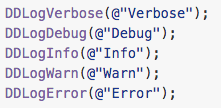
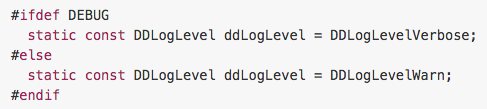
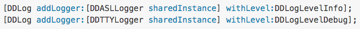
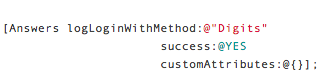
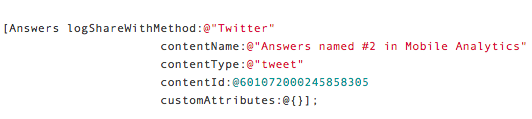
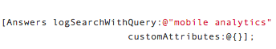

#Logging

Temos 3 mecanismos de log disponíveis.

1. [**NSLog**](https://developer.apple.com/library/mac/documentation/Cocoa/Reference/Foundation/Miscellaneous/Foundation_Functions/#//apple_ref/c/func/NSLog)

	Nativo disponível no Foundation Framework.
Somente output no debug console em tempo de desenvolvimento. De ser desativo para a build de production.

0. [**CocoaLamberjack**](https://github.com/CocoaLumberjack/CocoaLumberjack)

	CocoaLumberjack é framework de loggin rápido, simples e flexível, onde podemos definir onde queremos os logs, podendo escolher mais de um destino, até mesmo salvar em arquivos para posterior envio para um server. Pode ser instalado via Cocoapods.

	* Criando Loggers
	
		

	* Opções de log
	
		
		
	* Setando o nível de log
		* Por ambiente
		
		* Por Logger
		
	
	
0. [**Answers**](https://docs.fabric.io/ios/answers/index.html)

	Utilizar o *Answers* permite um acompanhamento remoto em real-time da sua aplicação, entedendo melhor o comportamento do usuário dentro.
	
	* Events
		
		Permite rastrear ações e eventos da aplicação, podem aproveitar os eventos já implementedos pelo framework, como Sign Up, Log in, Share, Search e podendo também criar seus próprios eventos costomizados.
		
		
		
		
		
	* Metrics
		
		Answers SDK coleta automaticamente as várias informações importantes sobre a aplicação.
		
		