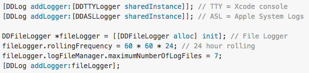

#Logging


1. **NSLog**

	Nativo disponível no Foundation Framework.
Somente output no debug console. Sempre ter um controle para não deixar logs importantes na build de production.

	```objective-c
	#ifdef DEBUG
	#   define DLog(fmt, ...) NSLog((@"%s [Line %d] " fmt), __PRETTY_FUNCTION__, __LINE__, ##__VA_ARGS__)
	#else
	#   define DLog(...)
	#endif
	
	// ALog always displays output regardless of the DEBUG setting
	#define ALog(fmt, ...) NSLog((@"%s [Line %d] " fmt), __PRETTY_FUNCTION__, __LINE__, ##__VA_ARGS__)
	```

	Para mais informação, consulte a documentação oficial da Apple [**aqui**](https://developer.apple.com/library/mac/documentation/Cocoa/Reference/Foundation/Miscellaneous/Foundation_Functions/#//apple_ref/c/func/NSLog).
	
0. **CocoaLamberjack**

	CocoaLumberjack é framework de loggin rápido, simples e flexível, onde podemos definir onde queremos os logs, podendo escolher mais de um destino, até mesmo salvar em arquivos para posterior envio para um server. Pode ser instalado via Cocoapods.

	* Criando Loggers
	
		```objective-c
		[DDLog addLogger:[DDTTYLogger sharedInstance]]; // TTY = Xcode console
		[DDLog addLogger:[DDASLLogger sharedInstance]]; // ASL = Apple System Logs
		
		DDFileLogger *fileLogger = [[DDFileLogger alloc] init]; // File Logger
		fileLogger.rollingFrequency = 60 * 60 * 24; // 24 hour rolling
		fileLogger.logFileManager.maximumNumberOfLogFiles = 7;
		[DDLog addLogger:fileLogger];
		```

	* Opções de log
	
		```objective-c
		DDLogVerbose(@"Verbose");
		DDLogDebug(@"Debug");
		DDLogInfo(@"Info");
		DDLogWarn(@"Warn");
		DDLogError(@"Error");		
		```
		
	* Setando o nível de log
	
		* Por ambiente
		
			```objective-c
			#ifdef DEBUG
			  static const DDLogLevel ddLogLevel = DDLogLevelVerbose;
			#else
			  static const DDLogLevel ddLogLevel = DDLogLevelWarn;
			#endif
			```

		* Por Logger
		
			```objective-c
			[DDLog addLogger:[DDASLLogger sharedInstance] withLevel:DDLogLevelInfo];
			[DDLog addLogger:[DDTTYLogger sharedInstance] withLevel:DDLogLevelDebug];
			```
	
	**Notes:** Para simplificar a utilização através de todo o projeto, coloque o import do framework no arquivo de Precompiled Header. Mas atenção porque nos novos Xcode projects os aquivos *pch* não são criados automaticamente, você terá que adiciona-lo manualmente.
	
	Para mais informação, consulte a documentação e exemplos no github do projeto [**aqui**](https://github.com/CocoaLumberjack/CocoaLumberjack).
	
0. **Answers**

	Utilizar o *Answers* permite um acompanhamento remoto em real-time da sua aplicação, entedendo melhor o comportamento do usuário dentro.
	
	* Events
		
		Permite rastrear ações e eventos da aplicação, podem aproveitar os eventos já implementedos pelo framework, como Sign Up, Log in, Share, Search e podendo também criar seus próprios eventos costomizados.
		
		```objective-c
		[Answers logSignUpWithMethod:@"Digits"
                      success:@YES
                      customAttributes:@{}];
       
       [Answers logShareWithMethod:@"Twitter"
                      contentName:@"Answers named #2 in Mobile Analytics"
                      contentType:@"tweet"
                      contentId:@601072000245858305
                      customAttributes:@{}];
                      
       [Answers logSearchWithQuery:@"mobile analytics"
                      customAttributes:@{}];
		```
		
	* Metrics
		
		Answers SDK coleta automaticamente as várias informações importantes sobre a aplicação.
		
		

	Para mais informação, consulte a documentação oficial do Answers no ste do Fabric clicando [**aqui**](https://docs.fabric.io/ios/answers/index.html)