# iOS Guidelines

Texto de introdução...

## Conteúdo
1. [Desenho Arquitetural](#desenho-arquitetural)
1. [Code Style](#code-style)
1. [Environment](#environment)
1. [Building](#building)
1. [Service](#service)
1. [Storage](#storage)
1. [Logging](#logging)
1. [Push](#remote-push-notification)

# Desenho Arquitetural

Esse documento apresenta um modelo de arquitetura baseado em MVC, porém customizado para atender o desenvolvimento mobile em Objective-C.

No iOS, tanto em Objective-C quanto em Swift, as divisões em camada é apenas lógica, sendo separadas em grupos no XCode, podendo também ser separada fisicamente no repositório do seu projeto, sendo isso uma boa prática. No entanto é necessário disciplina por parte dos desenvolvedores, pois como o XCode não gera automaticamente um novo folder para cada grupo criado, precisamos criá-las sempre que um novo grupo for adicionado. Existem ferramentas que auxiliam nesse processo de criação da estrutura de folders no XCode como o <**synx**>, que será detalhada mais adiante.

A comunicação entre as camadas pode ser realizada utilizando Delegates ou Blocks como callbacks.

## Camadas
Separemos as principais camadas e suas responsabilidades:

* **View**:

    * Responsável exclusivamente pela UI.
    
    * Animações, componentes de tela customizados
    
    * Referencias à componentes (IBOutlets) entre outros.

* **Controller**:

    * Responsável pelo controle de fluxo da aplicação, por validações e por escutar os eventos (IBActions)

    * Implementa protocolos referentes aos componentes de UI, por exemplo, UITableViewDataSource ou Delegate.

    * Acessos diretos aos componentes de UI devem ser evitados. Para isso acessamos a Camada de View.

* **Manager**:

    * Responsável pelas filas de execução. Podendo possuir uma instancia de NSOperationQueue, para casos de acesso assíncrono onde podemos ter filas de operações.

    * Controla a execução assíncrona ou não.

    * Terá acesso a camada de Business e será acessada pelas Controllers.

* **Business**:

    * Será responsavel por implementar regras de negócio.

* **Provider**:

    * Será a camada responsável por implementar um wrapper para mecanismos provedores de dados.

    * Por exemplo DataBaseProvider ou ConnectionProvider. Para acesso a um DataBase local ou Conexão ao backend respectivamente.

    * Criaremos providers para libraries de acesso externos também, como Social, Analytics

* **UI Components**

    * Deve conter apenas classes que herdam de algum componente do UIKIT framework

    * Utilizado quando necessário customizar algum componente já existente, por exemplo: um UIButton que precisa ter uma borda arredondada na cor azul

	**MVC Pattern em iOS**

	

	**Modelo proposto**

	

1. **Model**

	Objetos de modelo encapsulam dados específicos para um aplicativo e define a lógica que manipula e processa os dados. Por exemplo, um objeto de modelo pode representar um personagem em um jogo ou representar um contato em um livro de endereços, por exemplo. Um objeto de modelo pode ter para-um e para-muitos relacionamentos com outros objetos do modelo, e por isso às vezes a camada de modelo de um aplicativo é efetivamente um ou mais objetos gráficos. Grande parte dos dados que fazem parte da persistencia do aplicativo (seja esse estado persistente armazenado em arquivos ou bancos de dados) deve permanecer nos objetos do modelo após os dados carregados no aplicativo. Porque os objetos do modelo representam conhecimentos e competências relacionadas com um domínio específico de problema, portanto podem ser reutilizados em outros domínios com problemas semelhantes. Um objeto de modelo não deve se comunicar com a camada de view responsável por apresentar seus dados e permitir que os usuários os editem.

	**Nomenclatura:** CITBuyList, CITShoppingCart. Como demonstrado nos exemplos a nomenclatura das classes dessa camada deve ser o prefixo do projeto + nome da entidade.

0. **View**

	A camada de view é um objeto na aplicação ao qual os usuários conseguem visualizar. Um view object sabe como se exibir na tela e pode responder às ações dos usuários.

	Basicamente a funcionalidade principal de um view object é exibir os dados da camada de modelo e permitir o usuário interagir editando esses dados. É claro que a camada de view precisa estar totalmente desacoplada da camada de modelo em uma aplicação MVC.

	**Comunicação**: View objects sabem sobre as alterações no modelo de dados através da camada controller e então apresenta essas alterações ao usuário. No caminho contrário, por exemplo, quando o usuário insere com algum texto no text field o valor é repassado através da controller que repassar ao controller.

	**Nomenclatura:** CITBuyListView, CITShoppingCartView. Como demonstrado nos exemplos a nomenclatura das classes dessa camada deve ser o prefixo do projeto + nome da tela que ela irá renderizar + sufixo View.

	**_e código exemplo para cada camada_**

0. **Controller**

	Um controller object atua como um intermediário entre um ou mais dos view objects de um aplicativo e um ou mais de seus model objects. Controller objects são, portanto, um canal através do qual view objects são notificados sobre mudanças no modelo e vice-versa. Controller objects também pode executar tarefas de configuração e de coordenação para um aplicativo e gerenciar os ciclos de vida de outros objetos.

	**Comunicação**: Um controller object interpreta as ações do usuário feita tendo em vista objetos e comunica dados novos ou alterados para a camada de modelo. Quando objetos do modelo mudarem, um controller object comunica que os novos dados de modelo para os view objects, para que possam exibí-lo.

	

	**Nomenclatura:** CITBuyListController, CITShoppingCartController. Como demonstrado nos exemplos a nomenclatura das classes dessa camada deve ser o prefixo do projeto + nome da tela que irá controlar + sufixo Controller.

0. **Provider**

	O provider é responsável pela a abstração das chamadas a 3rd libraries, fortemente baseado no design pattern Facade, garante assim, manutenibilidade e flexibilidade.

	O ideal é que tenhamos um provider por propósito, por exemplo: Em um app que temos integração com redes sociais poderíamos tranquilamente ter um provider que possuiria os métodos "authenticate", "post", "friendsList" e dessa forma caso precisássemos substituir a rede social por outra, o impacto seria mínimo pois alteraríamos somente o provider as demais camadas esperariam o mesmo retorno e continuariam chamando a mesma assinatura de método.

	

	Ou em algum cenário mais complexo no qual a library não seria substituída, mas sim acrescentada de modo que o provider utilize recursos de duas, três, quatro…n libraries ao longo do ciclo de uso da app.

	Nesse caso nosso provider, além do Facade pattern, também precisaria do Strategy pattern.

	

	**Nomenclatura:** CITBuyListProvider, CITShoppingCartProvider. Como demonstrado nos exemplos a nomenclatura das classes dessa camada deve ser o prefixo do projeto + nome do módulo que ela irá validar + sufixo Provider.

0. **Manager**

	Essa camada é responsável por controlar todo o fluxo de requisições. Se comunica diretamente com Controller e Business, podendo conter uma instancia de [NSOperationQueue](https://developer.apple.com/library/ios/documentation/Cocoa/Reference/NSOperationQueue_class/) para controlar operações assíncronas e toda a facilidade de poder cancelar uma operação, pausar, estabelecer relação de dependência entre operações.

	Utilizamos um manager por controller.

	**Nomenclatura:** CITBuyListManager, CITShoppingCartManager. Como demonstrado nos exemplos a nomenclatura das classes dessa camada deve ser o prefixo do projeto + nome do módulo o qual ela é responsável + sufixo Manager.

0. **Infrastructure**

	* **Messages**

		Essa camada tem como proprósito centralizar todos os textos de mensagem da app e abstrair ao máximo todos os mecanismos de mensagens que a app venha a utilizar, seja baner, alert, tooltip.

		

	* **Logging**

		A camada de logging também está presente na layer de infrastructure.

0. **Business**

	Herdando de NSObject ela se propõe a concentrar toda a regra de negócio do cliente. O ideal, assim como nas outras camadas, é que os métodos sejam curtos e objetivos e essa camada deverá se comunicar apenas com as camadas manager e provider.

	**Nomenclatura:** CITBuyListBO, CITShoppingCartBO. Como demonstrado nos exemplos a nomenclatura das classes dessa camada deve ser o prefixo do projeto + nome do módulo que ela irá validar + sufixo BO que representa Business Object.

0. **Security**

	Na camada de segurança ficarão todos os algorítmos necessários para garantir o sigilo dos dados. Alguns desses mecanismos são: Keychain, RC4, NSKeyedArchive, SQLCipher.

	**Nomenclatura:** CITKeychain, CITSQLCipher. Como demonstrado nos exemplos a nomenclatura das classes dessa camada deve ser o prefixo do projeto + nome do recurso.

# Code Style

## Nomenclaturas de arquivos

1. **Class**

    O padrão [UpperCamelCase](https://en.wikipedia.org/wiki/CamelCase) é recomendado para nomear arquivos de classes e utilizar o prefixo de 2 ou 3 letras que facilite identificar classes do projeto, exemplo:

    * HenrySchein
       * **HSN**LoginViewController
       * **HSN**HTTPClient
        
    * TetraPak
    	* **TPK**LoginViewController
    	* **TPK**OperationManager

      

    	E para as classes que herdam de um componente do UIKit 		framework, o nome deve terminar com o nome do componente, 		exemplo: 
    	
    	 - CITLogin**ViewController** 
    	 - CITDashboard**View**
    	 - CITClients**TableViewController**
    	 - CITCards**CollectionViewController**

0. **Resources**

    1. **Convenções para Icones:**

    0. **Convenções para Button state:**

        <table>
          <tr>
            <td>Sufixo</td>
            <td>Exemplo</td>
          </tr>
          <tr>
            <td>_normal</td>
            <td>button_normal</td>
          </tr>
          <tr>
            <td>_pressed</td>
            <td>button_pressed</td>
          </tr>
          <tr>
            <td>_disabled</td>
            <td>button_disabled</td>
          </tr>
          <tr>
            <td>_selected</td>
            <td>button_selected</td>
          </tr>
        </table>

## Objective-C Style

1. **Properties**

    As propriedades devem ser cadastradas no inicio da classe, com as seguintes regras:

    * Componente, sempre utilizar o tipo do componente como sufixo, e.g: login**Button**, username**TextField**, information**Label**

    * Sempre iniciar com letra minúscula.

    * O nome declarado será o mesmo utilizado pelo getter/setter. Se a propriedade for escrita como um verbo ou substantivo o formato é:

      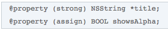

	* Se o nome for declarado como um adjetivo, então o nome da propriedade oculta o prefixo *"is", *você deve especificá-lo no get acessor.

		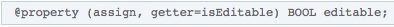

	* Certifique-se de que o nome de uma variável de instancia descreve exatamente o atributo alocado. Não se deve acessar a variável de instancia diretamente, para isso utilize os *"acessor methods"*. Só acessamos uma variável de instancia diretamente nos métodos init e dealloc, para isso faça.

		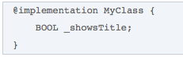

0. **Métodos**

	A assinatura do método deve ser algo auto explicativa quando lida. Por exemplo o método:

	

	Se tiramos os parâmetros a assinatura lida seria: **touchesBeganWithEvent**

	O método sempre deve cuidar de pequenas funções, ter um objetivo, caso ultrapasse de 40 linhas pense na possibilidade de separar em outro método sem prejudicar a estrutura.

	* Em geral não abrevie nomes. Escreva mesmo que seja longo.

		

	* Use palavras-chave antes de todos os argumentos.

		

	* Faça com que a palavra que antecede o argumento o descreva.

		


0. **Ordens dos itens da classe**

	Não existe uma forma correta de ordenar os itens de uma classe, mas uma ordem lógica e consistente facilita a leitura e entendimento do código. Nós recomendamos a seguinte ordem:

	1. Imports
	2. Constantes
	3. Protocolos
	4. Atríbutos
	5. Construtores
	6. Métodos publicos
	7. Métodos Privados
	8. Override de métodos e callbacks

0. **Ordenação dos parâmetros de métodos e callbacks**

	As interfaces de *callback* devem ser o último parâmetro.

	

0. **Enumerated Constants**

	* Use *enumerations *para grupos de constantes relacionadas que possuem valores inteiros

		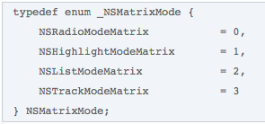

0. **Delegate Methods**

	* Inicie o nome identificando a classe de objeto que está enviando a mensagem.

		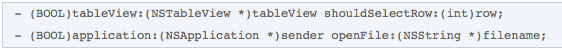

	* Use "did" ou "will" para métodos invocados para notificar o delegate de que algo aconteceu ou acontecerá.

		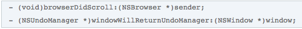

	* Embora você possa usar *"did"* ou *"will"* para métodos que são invocados para perguntar ao delegate para fazer algo a favor de outro objeto, é melhor utilizar *"should"*

		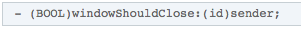

0. **Blocks**

	* **Declarando e utilizando um Block**

	

	* **Usando um Block diretamente**

		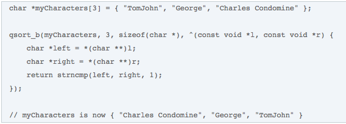

	* **Padrões que devem ser evitados**

		

[**ObjClean:**](http://objclean.com/index.php)

* [FullVersion](https://checkout.paddle.com/pay/2005746-chrea8fe174f405-b68729dbe7)
* [Free Trial](http://bit.ly/1nI4auv)
* [Template File](https://drive.google.com/a/ciandt.com/file/d/0B-zev7olcxWtZFNkMXUtbFVobDQ/view?usp=sharing)

**Source:** [https://developer.apple.com/library/mac/documentation/Cocoa/Conceptual/CodingGuidelines/CodingGuidelines.html#//apple_ref/doc/uid/10000146-SW1](https://developer.apple.com/library/ios/documentation/Cocoa/Conceptual/CodingGuidelines/CodingGuidelines.html#//apple_ref/doc/uid/10000146-SW1)

# Environment

### IDE

O Xcode IDE está no centro da experiência de desenvolvimento da Apple. Totalmente integrado com os quadros de Cocoa e Cocoa Touch, Xcode é um ambiente extremamente produtivo para a criação de aplicativos para Mac, iPhone e iPad.

Porque tudo é tão bem integrado, os fluxos de trabalho são naturais. Como você compor uma nova interface, o editor assistente apresenta intuitivamente os respectivos códigos fonte em um painel em janela dividida. Basta arrastar o mouse para conectar controles de interface do usuário para o código de implementação. Tecnologias de compilador Apple LLVM para analisar seu código, mantendo cada símbolo que você vê no LLDB debugger consistente com o editor e compilador. Conforme você digita a engine está em trabalho constante, encontrando erros e oferecendo Fix-its para o seu código.

O desenvolvedor pode se comunicar com o site da Apple diretamente pelo xCode, assim você pode ativar serviços como Game Center ou Passbook em seu aplicativo com um único clique. Em conjunto com o OS X Server, Xcode pode configurar um bot remoto para o ambiente de continuous integration, analisar, testar, e até mesmo empacotar seu aplicativo. Quando seu aplicativo está pronto, o Xcode irá agrupar e apresentar o seu aplicativo para a que você submita seu aplicativo para a App Store.

[**Download Xcode**](https://developer.apple.com/xcode/download/)

### Gerenciador de Dependências

Utilizamos o [Cocoapods](https://cocoapods.org), construído em ruby, como gerenciador de dependências. No OS X o Ruby vem instalado por padrão, não precisa se preocupar em instalá-lo.

Para instalar o Cocoapods basta executar o seguinte comando no terminal.

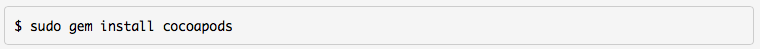

Após o cocoapods ser instalado, vá na pasta do seu projeto e crie um arquivo nomeado Podfile com a seguinte estrutura

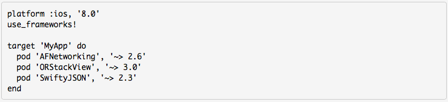

Para incluir as libs que você deseja basta inserir " pod 'LibDesejada', 'versão' " abaixo do target. Para facilitar esse trabalho execute o comando pod init e ele criará a estrutura padrão. É altamente recomendado que use esse comando.

Após criado o Podfile e adicionadas as libraries desejadas execute o seguinte comando


Certifique-se de sempre abrir o workspace gerado pelo cocoapods para o projeto.


### Apple Developer Certificate

Para desenvolvimento na plataforma iOS é necessário que se tenha certificado válido e provisioning profile para a aplicação, portanto é necessário gerar um certificado por desenvolvedor.

Para isso há uma série de passos a serem feitos.

1º - É necessário solicitar uma assinatura de certificado.


2º - Preencha os campos com suas credenciais developer apple.


3º - Depois de gerado o *CertificateSigningRequest.certSigningRequest* vá ao [*Member Center*](https://developer.apple.com) e feito o login procure a área *Certificates, Identifiers & Profiles*


4º - Clique no botão *Add *para criar um novo certificado.


5º - Selecione a opção *iOS Development*.


6º - Faça o upload do arquivo gerado no passo 2 e em seguida clique em *Generate*.


7º - Pronto! Agora o seu certificado e chave aparecerão no keychain.


### Creating an App ID

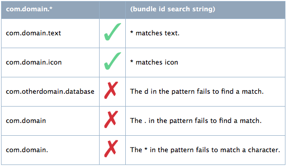

### Clientes de Versionamento

Quando todo o repositório do seu projeto estiver versionado no SVN recomendamos que utilize o [Cornerstone](https://www.zennaware.com/cornerstone/index.php), pago, porém a Ci&T possui licenças.

Se o repositório for baseado no git pode utilizar [SourceTree](https://www.sourcetreeapp.com) ou [Github Desktop](https://desktop.github.com).

# Building

## Targets

Targets permitem que você tenha configurações específicas para cada ambiente que você tenha.

Um target especifíca um produto e contém instruções para construí-lo a partir de um conjunto de arquivos em um projeto ou workspace. Um target é referente a um único produto, porém os source files podem ser compartilhados entre os múltiplos targets que um projeto possa ter.

Recomendamos targets para facilitar na separação e fácil configuração do ambiente de CI para gerar build para cada ambiente visto que as sessãos de build settings, capabilities, build phases e o plist são exclusivas para cada target.

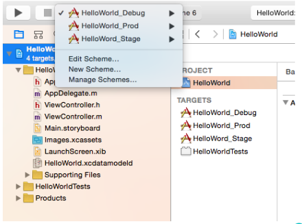

### Criando Targets

O ideal é duplicar o target já existente e então apenas renomear o novo target para algo que faça sentido, geralmente colocamos o NomeDoProjeto_ambiente.


## Schemes

Schemes defininem basicamente o que aconte quando clicamos em Run, Test, Profile, Analyze ou Archive. Contem informações como Targets a serem executados, build configuration e launch arguments.

Você pode ter quantos schemes você quiser, mas somente um estará ativo por vez, até mesmo porque esse será o scheme que será utilizar para executar o app, seja o destino o hardware ou o simulador.

É recomendado que se tenha um schema por target de ambiente criado.


## Plist

Cada schema possui o seu plist, ou seja, é um ótimo lugar para adicionar configurações exclusivas de cada target.


# Service

Com o propósito de comunicação com o web service utilizamos o AFNetworking como library de alta abastração do [Foundation URL Loading System](http://developer.apple.com/library/mac/#documentation/Cocoa/Conceptual/URLLoadingSystem/URLLoadingSystem.html). O AFNetworking possui uma arquitetura modular e bem desenhada conseguiu simplificar os callbacks e serializações do Foundation URL.

O Foundation URL funciona dessa forma:


O AFNetworking está acima de tudo isso, ou seja, toda a parte de cache management, cookie storage, protocolo, autenticação e etc ele cuida para nós e nos proporciona objetos e flags simples para a configuração dos mesmos.

Abaixo podemos conferir como encaixar essa library em nossa arquitetura.


* **CITHTTPSessionProvider (//TODO 1)**

    * Herda a principal classe do AFNetworking, *AFHTTPSessionManager.*

    * Para melhor controle das requisições e configuração do Header aplicamos o *singleton pattern *para garantir a integridade.

    * Faça o override do método *initWithBaseURL *e configure o *request* e *response* *serializer*.

	

* **CITHTTPSessionProvider Category (//TODO 2)**

    * Deve se criar uma category exclusiva para cada serviço.

    * Os métodos de consumo ao serviço devem ser estáticos.

    * Para callback do service response devemos usar blocks.

    * Caso sejam poucos parâmetros a serem enviados no body podemos construir o dicionário no método da categoria, porém se for muito complexo essa serialização deverá ficar no modelo.

	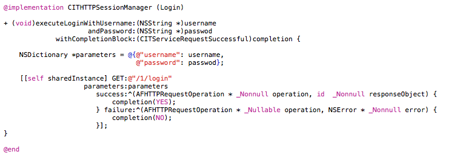
	
Para melhor entendimento você pode conferir um código exemplo [AQUI](https://github.com/CIT-SWAT/iOS-ReferenceArchitecture/tree/master/NetworkSample).

# Storage

# Storage

No iOS temos 4 opções de armazenamento:

* File system
* User Defaults
* SQLite
* Keychain

Saber quando utilizar cada um deles é crucial para uma boa manutenibilidade do código.

### User Defaults

Utilize quando precisar gravar dados simples do tipo chave/valor. Não Possui limitação de tamanho de objeto, a capacidade do device é o limite.
Área exclusiva por aplicativo, não é possível compartilhar dados entre aplicativos nessa área. Um ponto importante para ter em mente é que essa área não é segura, portanto nunca salve dados sensíveis aqui.
Ex. Preferências do aplicativo, timestamp de obtenção de token de API, flags indicando que o usuário já visualizou um determinado tutorial ou passou por certo fluxo, etc.

### Keychain
Basicamente atende ao mesmo propósito do User Defaults, salvar chave/valor, porém de forma segura. Altamente recomendado para armazenar dados sensíveis do usuário.
Ex: Armazenar token de sessão, password e etc.

### SQLite
Utilize o SQLite para armazenar dados inerentes às entidades de seu modelo de negócio. 
Ex. Para um aplicativo de força de vendas, os dados dos clientes como nome, endereço, telefone, etc devem ser armazenados em uma tabela do SQLite e mapeados em uma entidade do seu modelo de negócio, como por exemplo uma classe Customer
Idealmente, cada entidade tem uma tabela no SQLite para armazenar seus dados.

É recomendado que a implementação de acesso ao SQLite seja feita através da library [FMDB](https://github.com/ccgus/fmdb) junto ao [CITFramework](https://github.com/CIT-SWAT/iOS-Guidelines/tree/master/Samples/CITFramework) que contém o CITDatabase que já é um Provider junto a algumas categories auxiliares.

Alguns pontos a se considerar seriam:

* Um banco por usuário. O framework se encarrega de converter o username em um md5 mapeando o banco local em uma pasta que possui esse hash como nome dentro de Documents.
* O manager possui protocolos para os scripts de criação/migração e versionamento.
* Não possui ORM, portanto é preciso escrever as queries.
* O FMDB deverá ser instalado através do cocoapods.
* Todos os callbacks são feitos com blocks.
* Tente sempre criar constantes para as queries.
* O FMDB já se encarrega da concorrência, para fazer isso de modo fácil e rápido utilize a classe CITDatabaseQueue.

Confira [AQUI](https://github.com/CIT-SWAT/iOS-Guidelines/tree/master/Samples/DatabaseSample) o exemplo do FMDB em funcionamento (é necessário executar o comando pod install para gerar o workspace).


Entendendo o CITDatabase
Schema (//TODO 1)
 Esse arquivo deve assinar os protocolos contidos no arquivo "CITDatabaseManager".
Nessa classe deve conter todas as queries de create table no método createTableQueries.
É p reciso criar um arquivo por versão de banco, dessa forma a migração ocorrerá sem grandes problemas.
Para que a migração funcione é necessário implementar os métodos schemaVersion e newVersion que retornarão um inteiro referente a versão do schema e da nova versão do db relacionado ao schema.

Data Access Categories (//TODO 2)
Deve ser uma category por tabela do banco.
Nessa classe estarão todos os métodos e queries de insert, update, delete e select.

### File System
o sistema de arquivos do dispositivo pode ser utilizado para armazenar arquivos criados pela aplicação ou dados serializados. Arquivos nesta área são criados utilizando a classe [NSFileManager](https://developer.apple.com/library/ios/documentation/Cocoa/Reference/Foundation/Classes/NSFileManager_Class/). 


* **Data Container**

	Area privada por aplicação. Deve ser utilizada para armazenar dados privados ou que interessam somente à aplicação como imagens adicionais baixadas para serem mostradas dentro do aplicativo, PDFs gerados pelo app e etc . Esta área também é utilizada como área de cache padrão do framework. Ao desinstalar o aplicativo, todos os dados salvos nesta área removidos.

	* **Documents**

		Use esse diretório para salvar conteúdo gerado pelo o usuário. 
O conteúdo desse diretório poderá ficar disponível para o usuário atráves do compartilhamento de arquivo, portanto esse diretório deve conter apenas arquivos que você queira expor ao usuário. 
O conteúdo desse diretório é salvo pelo backup do iTunes.

	* **Library**

		Ideal para todo e qualquer arquivo que você não deseja expor ao usuário.
Todos o conteúdo, com exceção dos subdiretórios da pasta Cache, serão salvos pelo o backup do iTunes.
Sua app não deve usar esse diretório para arquivos de dados do usuário.

	* **Temp**
 
		Use esse diretório para salvar arquivos temporários.
Quando não forem mais necessários, quando sua app não estiver mais em uso os arquivos desse diretório serão deletados.
O conteúdo desse diretório não é salvo pelo backup do iTunes.

* **iCloud Container**
	
	Também utiliza NSFileManager com o ubiquitous, ideal para salvar arquivos que tem certa relevância a ponto de não poder perder tais arquivos caso o app seja resetado ou deletado.

Para saber mais sobre os tipos de armazenamento e suas características veja a documentaçãp oficial [aqui](https://developer.apple.com/library/ios/documentation/FileManagement/Conceptual/FileSystemProgrammingGuide/Introduction/Introduction.html#//apple_ref/doc/uid/TP40010672-CH1-SW1).

# Logging

1. **NSLog**

	Nativo disponível no Foundation Framework.
Somente output no debug console. Sempre ter um controle para não deixar logs importantes na build de production.

	```objective-c
	#ifdef DEBUG
	#   define DLog(fmt, ...) NSLog((@"%s [Line %d] " fmt), __PRETTY_FUNCTION__, __LINE__, ##__VA_ARGS__)
	#else
	#   define DLog(...)
	#endif
	
	// ALog always displays output regardless of the DEBUG setting
	#define ALog(fmt, ...) NSLog((@"%s [Line %d] " fmt), __PRETTY_FUNCTION__, __LINE__, ##__VA_ARGS__)
	```

	Para mais informação, consulte a documentação oficial da Apple [**aqui**](https://developer.apple.com/library/mac/documentation/Cocoa/Reference/Foundation/Miscellaneous/Foundation_Functions/#//apple_ref/c/func/NSLog).
	
0. **CocoaLamberjack**

	CocoaLumberjack é framework de loggin rápido, simples e flexível, onde podemos definir onde queremos os logs, podendo escolher mais de um destino, até mesmo salvar em arquivos para posterior envio para um server. Pode ser instalado via Cocoapods.

	* Criando Loggers
	
		```objective-c
		[DDLog addLogger:[DDTTYLogger sharedInstance]]; // TTY = Xcode console
		[DDLog addLogger:[DDASLLogger sharedInstance]]; // ASL = Apple System Logs
		
		DDFileLogger *fileLogger = [[DDFileLogger alloc] init]; // File Logger
		fileLogger.rollingFrequency = 60 * 60 * 24; // 24 hour rolling
		fileLogger.logFileManager.maximumNumberOfLogFiles = 7;
		[DDLog addLogger:fileLogger];
		```

	* Opções de log
	
		```objective-c
		DDLogVerbose(@"Verbose");
		DDLogDebug(@"Debug");
		DDLogInfo(@"Info");
		DDLogWarn(@"Warn");
		DDLogError(@"Error");		
		```
		
	* Setando o nível de log
	
		* Por ambiente
		
			```objective-c
			#ifdef DEBUG
			  static const DDLogLevel ddLogLevel = DDLogLevelVerbose;
			#else
			  static const DDLogLevel ddLogLevel = DDLogLevelWarn;
			#endif
			```

		* Por Logger
		
			```objective-c
			[DDLog addLogger:[DDASLLogger sharedInstance] withLevel:DDLogLevelInfo];
			[DDLog addLogger:[DDTTYLogger sharedInstance] withLevel:DDLogLevelDebug];
			```
	
	**Notes:** Para simplificar a utilização através de todo o projeto, coloque o import do framework no arquivo de Precompiled Header. Mas atenção porque nos novos Xcode projects os aquivos *pch* não são criados automaticamente, você terá que adiciona-lo manualmente.
	
	Para mais informação, consulte a documentação e exemplos no github do projeto [**aqui**](https://github.com/CocoaLumberjack/CocoaLumberjack).
	
0. **Answers**

	Utilizar o *Answers* permite um acompanhamento remoto em real-time da sua aplicação, entedendo melhor o comportamento do usuário dentro.
	
	* Events
		
		Permite rastrear ações e eventos da aplicação, podem aproveitar os eventos já implementedos pelo framework, como Sign Up, Log in, Share, Search e podendo também criar seus próprios eventos costomizados.
		
		```objective-c
		[Answers logSignUpWithMethod:@"Digits"
                      success:@YES
                      customAttributes:@{}];
       
       [Answers logShareWithMethod:@"Twitter"
                      contentName:@"Answers named #2 in Mobile Analytics"
                      contentType:@"tweet"
                      contentId:@601072000245858305
                      customAttributes:@{}];
                      
       [Answers logSearchWithQuery:@"mobile analytics"
                      customAttributes:@{}];
		```
		
	* Metrics
		
		Answers SDK coleta automaticamente as várias informações importantes sobre a aplicação.
		
		

	Para mais informação, consulte a documentação oficial do Answers no ste do Fabric clicando [**aqui**](https://docs.fabric.io/ios/answers/index.html)

# Remote Push Notification

O mecanismo de push é muito utilizado para propagar informação a partir de um servidor, alguns exemplos de uso seriam: um novo comentário na rede social, uma nova mensagem no chat, algum relatório o qual o processamento foi concluído no servidor. E todos esses casos quando você deseja realmente garantir a entrega ao usuário, mesmo que o app não esteja em execução ou nem sequer em background. Dois pontos de atenção são: a conexão a internet é fundamental para receber essa notificação e é necessário habilitar o mecanismo de push notification no certificado de sua app.

1. **A Remote Notification and Its Path**

	* Apple Push Notification service é responsável por transportar e entregar uma remote notification de um determinado provider a um determinado device. A notificação é uma curta mensagem constituída por duas partes de dado: o device token e o payload. O device token é análogo ao número de telefone; ele contém informações que permitem a APNs para localizar cada device para um client app instalado. O payload é uma JSON-defined que especifica como o usuário de uma app no device irá ser alertado.

		

		
		Figure 1  Pushing a remote notification from a provider to a client app

	

		
		Figure 2  Pushing remote notifications from multiple providers to multiple devices

0. **Service-to-Device Connection Trust**

	* Estabelece a identidade de um dispositivo de conexão através TLS peer-to-peer authentication

	

0. **Provider-to-Service Connection Trust**

	* A conexão segura entre o provider e APNs é também estabelecida através deTLS peer-to-peer authentication.

	

0. **Token Generation and Dispersal**

	A app precisa se registrar para receber remote notifications. Isso geralmente acontece logo após abrir o app pela primeira vez, pois no método *didFinishLaunchingWithOptions *colocamos o seguinte código para tal propósito.

	

	Esse trecho de código permite o funcionamento ilustrado abaixo:

	

	O token gerado chegará no seguinte método, que também deve ser implementado.

	

	O hexToken é o código identificador do seu device para sua app, esse é o código que deverá ser enviado ao web service provider, como mostra o esquema abaixo:

	

	É necessário também implementar o seguinte método pelo qual os dados do push será recebido.

	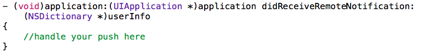

Para saber mais detalhes e características dos mecanismos de push veja a docuementação oficial [AQUI](https://developer.apple.com/library/ios/documentation/NetworkingInternet/Conceptual/RemoteNotificationsPG/Chapters/ApplePushService.html#//apple_ref/doc/uid/TP40008194-CH100-SW9).
